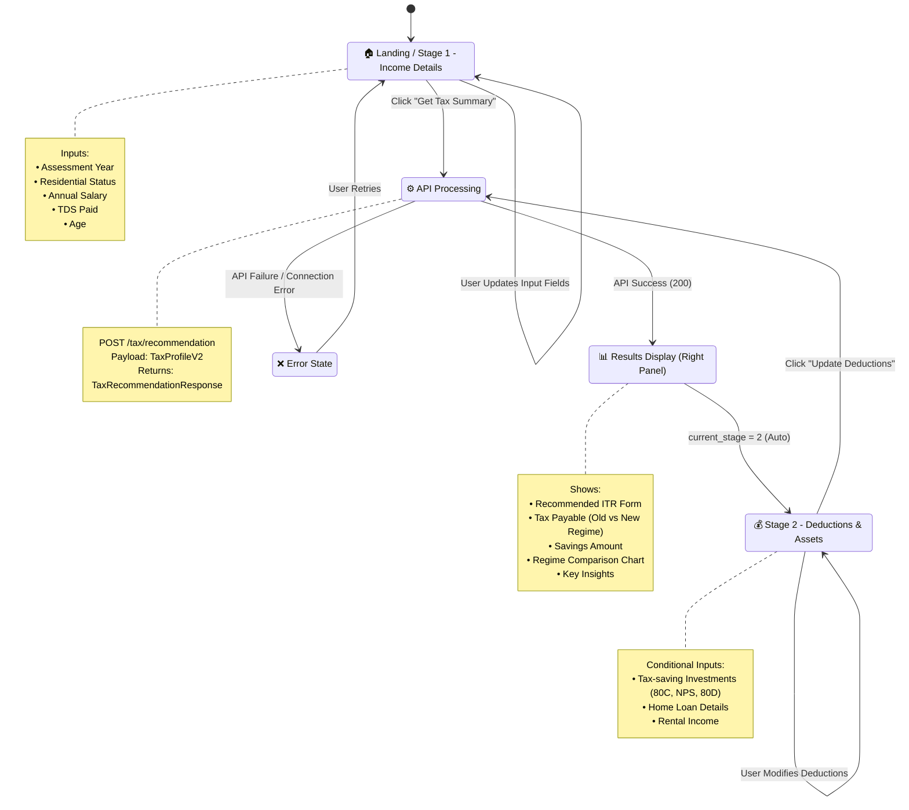

# WealthWise AI - User Journey Flow Analysis

## Executive Summary
**Application Type:** Tax Planning & Recommendation Engine  
**Technology:** Streamlit (Python-based web app)  
**State Management:** `st.session_state` (Streamlit's session state)  
**Architecture:** Multi-stage progressive disclosure with API-driven calculations

---

## 📊 Visual Screen Flow Diagram



---

## 🧭 State Management Deep Dive

### Central State Variables

| State Variable | Type | Purpose | Triggers |
|---------------|------|---------|----------|
| `st.session_state["current_stage"]` | `int` | Controls which form sections are visible | Button clicks, API success |
| `st.session_state["stage1"]` | `dict` | Stores income-related inputs | User input changes |
| `st.session_state["stage2"]` | `dict` | Stores deduction/asset inputs | User input changes |
| `st.session_state["last_reco"]` | `dict` or `None` | Cached API response | API success |

### Stage Progression Logic

```python
# Stage Detection Logic (from code)
s1_done = st.session_state["stage1"].get("salary_gross", 0) > 0
s2_done = st.session_state.get("last_reco") is not None

current_step = 1
if s1_done and not s2_done:
    current_step = 2
elif s2_done:
    current_step = 3
```

**Interpretation:**
- **Stage 1 (Income):** Always visible. Considered "done" when `salary_gross > 0`
- **Stage 2 (Deductions):** Only rendered when `current_stage >= 2` (after first API call succeeds)
- **Stage 3 (Optimize):** Visual indicator only; no distinct screen
- **Stage 4 (Review):** Placeholder in progress stepper; not implemented yet

---

## 🎯 Screen Catalog (Nodes)

### 1. **Landing / Stage 1: Income Details**
**Trigger:** App initialization  
**State Condition:** `current_stage == 1` (default)

**UI Elements:**
- Top Bar: App title + regime badge (if recommendation exists)
- Progress Stepper (Left Panel): 4 steps with visual states
- Form Card (Center Panel):
  - Assessment Year dropdown (2024-25 / 2025-26)
  - Residential Status dropdown (Resident India / Non Resident)
  - Annual Salary number input
  - TDS Paid number input
  - Age number input
  - **Primary CTA:** "Get Tax Summary" button
- Results Placeholder (Right Panel): Placeholder chart + "Fill income to see tax" message

**Exit Conditions:**
- User clicks "Get Tax Summary" → API call triggered

---

### 2. **API Processing State**
**Trigger:** "Get Tax Summary" or "Update Deductions" button click  
**State Condition:** N/A (transient state)

**UI Elements:**
- Spinner with text: "Calculating..."

**API Call Details:**
```python
POST {api_base}/tax/recommendation
Content-Type: application/json
Body: {
  "profile_version": "v2",
  "assessment_year": "2024-25",
  "tax_facts_input": { ... },
  "user_identity": {},
  "document_payloads": null,
  "chat_clarifications": null
}
```

**Exit Conditions:**
- **Success (200):** → Results Display + Stage 2 unlocked
- **Failure (4xx/5xx):** → Error State
- **Connection Error:** → Error State

---

### 3. **Results Display (Right Panel)**
**Trigger:** Successful API response  
**State Condition:** `st.session_state["last_reco"] is not None`

**UI Elements:**
- **Result Card:**
  - ITR Form badge (e.g., "ITR-1")
  - Tax Payable amount (₹ formatted)
  - Recommended regime (OLD / NEW)
  - Savings amount (if applicable)
- **Comparison Chart:**
  - Plotly bar chart showing Old vs New regime tax
  - Highlighted recommended regime
- **Key Insights Card:**
  - Bullet points explaining recommendation (max 4)

**Conditional Logic:**
```python
if regime == "OLD":
    tax_payable = old_tax
    savings = new_tax - old_tax if new_tax > old_tax else 0
else:
    tax_payable = new_tax
    savings = old_tax - new_tax if old_tax > new_tax else 0
```

**Exit Conditions:**
- Always persistent; updates on new API calls

---

### 4. **Stage 2: Deductions & Assets**
**Trigger:** Successful first API call  
**State Condition:** `st.session_state["current_stage"] >= 2`

**UI Elements:**
- Form Card (appended below Stage 1):
  - **Investment Section:**
    - Checkbox: "I have tax-saving investments"
    - Conditional inputs (if checked):
      - Section 80C (max ₹150,000)
      - NPS (80CCD 1B) (max ₹50,000)
      - Health Insurance (80D)
  - **Home Loan Section:**
    - Checkbox: "I have a home loan"
    - Conditional inputs (if checked):
      - Interest Paid (₹/year)
      - Loan Outstanding
  - **Rental Section:**
    - Checkbox: "I earn rental income"
    - Conditional inputs (if checked):
      - Annual Rental (₹)
      - Number of Properties
  - **Primary CTA:** "Update Deductions" button

**Exit Conditions:**
- User clicks "Update Deductions" → Re-triggers API Processing

---

### 5. **Error State**
**Trigger:** API failure or connection error  
**State Condition:** N/A (ephemeral)

**UI Elements:**
- Red error message:
  - `❌ Error {status}: {detail}` (API error)
  - `❌ Cannot connect to API on port 8000` (connection error)
  - `❌ Exception: {error_message}` (unexpected error)

**Exit Conditions:**
- User corrects input and retries button click
- No explicit "Dismiss" button; error persists until next action

---

## 🚶 Happy Path: Step-by-Step Walkthrough

### **Step 1: User Lands on App**
**System Response:**
- Renders Stage 1 form with default values
- Shows empty results placeholder
- Progress stepper shows "Income" as active step
- API health check runs in background (displays green ✅ or yellow ⚠️ in left panel)

**User State:**
- `current_stage = 1`
- `last_reco = None`
- All inputs set to defaults (salary: 0, age: 18, etc.)

---

### **Step 2: User Fills Income Details**
**User Actions:**
1. Selects Assessment Year (e.g., "2024-25")
2. Confirms Residential Status (default: "Resident India")
3. Enters Annual Salary (e.g., ₹1,200,000)
4. Enters TDS Paid (e.g., ₹80,000)
5. Adjusts Age (e.g., 32)

**System Response:**
- Values stored in `st.session_state["stage1"]` on each input change
- No validation errors; all fields accept free-form input

---

### **Step 3: User Clicks "Get Tax Summary"**
**System Actions:**
1. Captures latest input values from session state
2. Builds `TaxProfileV2` payload using `build_taxprofile_v2()`
3. Sends POST request to `/tax/recommendation`
4. Displays spinner: "Calculating..."

**Backend Processing:**
- API normalizes inputs to `TaxFacts` object
- Computes tax liability for both regimes
- Determines recommended regime using `get_tax_recommendation()`
- Returns JSON response with:
  - `regime.recommended`: "old" or "new"
  - `regime.old_tax`, `regime.new_tax`: numeric values
  - `itr.recommended`: "ITR-1", "ITR-2", etc.
  - `explanation.bullets`: array of strings

---

### **Step 4: Results Appear + Stage 2 Unlocks**
**System Response:**
1. Stores API response in `st.session_state["last_reco"]`
2. Sets `current_stage = 2`
3. Triggers `st.rerun()` to refresh UI
4. Progress stepper now shows "Income" as done (green ✓), "Deductions" as active

**Right Panel Updates:**
- Tax Payable card displays (e.g., "₹52,500" in OLD regime)
- Savings shown if applicable (e.g., "You Save ₹15,000 vs new regime")
- Chart renders comparing Old (₹52,500) vs New (₹67,500) tax
- Key Insights card shows up to 4 bullets:
  - _"Standard deduction of ₹50,000 applied"_
  - _"Old regime saves ₹15,000 due to 80C deductions"_
  - _"Consider maxing out 80C to ₹150,000 limit"_

**Top Bar Updates:**
- Badge appears: "OLD REGIME" (blue) or "NEW REGIME" (green)

---

### **Step 5: User Optimizes with Deductions**
**User Actions:**
1. Checks "I have tax-saving investments"
2. Enters Section 80C: ₹150,000
3. Enters NPS (80CCD 1B): ₹50,000
4. Enters Health Insurance (80D): ₹25,000
5. Optionally checks "I have a home loan" and fills interest paid
6. Clicks "Update Deductions"

**System Actions:**
1. Updates `st.session_state["stage2"]` with new values
2. Rebuilds payload with both stage1 + stage2 data
3. Re-triggers API call to `/tax/recommendation`

---

### **Step 6: Optimized Results Display**
**System Response:**
- Same as Step 4, but with updated calculations
- Tax Payable may decrease (e.g., ₹52,500 → ₹38,700)
- Savings amount updates dynamically
- Chart re-renders with new values
- Success message: "✅ Deductions updated!" (ephemeral, clears on rerun)

---

### **Step 7: User Reviews Final Recommendation**
**Final State:**
- Progress stepper shows Steps 1-2 as done (green ✓)
- Step 3 "Optimize" as active (blue)
- All inputs filled and locked-in via session state
- Results panel shows final ITR form + tax liability
- User can continue to tweak deductions or export results (future feature)

---

## 🔀 Conditional Navigation Forks

### **Fork 1: Regime Selection**
**Location:** Backend API logic  
**Condition:** Old regime tax vs New regime tax

```python
if old_tax < new_tax:
    recommended_regime = "old"
    savings = new_tax - old_tax
else:
    recommended_regime = "new"
    savings = old_tax - new_tax
```

**UI Impact:**
- Badge color changes (blue for OLD, green for NEW)
- Chart highlights winning regime with accent color
- Savings calculation references losing regime

---

### **Fork 2: Investment Inputs Visibility**
**Location:** Stage 2 form  
**Condition:** `st.checkbox("I have tax-saving investments")` state

```python
if st.session_state["stage2"]["has_investments"]:
    # Show 80C, NPS, 80D inputs
else:
    # Hide investment inputs; defaults to 0
```

---

### **Fork 3: Home Loan Inputs Visibility**
**Location:** Stage 2 form  
**Condition:** `st.checkbox("I have a home loan")` state

```python
if st.session_state["stage2"]["has_home_loan"]:
    # Show interest paid + loan amount inputs
else:
    # Hide loan inputs; defaults to 0
```

---

### **Fork 4: Rental Income Visibility**
**Location:** Stage 2 form  
**Condition:** `st.checkbox("I earn rental income")` state

```python
if st.session_state["stage2"]["has_rental"]:
    # Show rental income + property count inputs
else:
    # Hide rental inputs; defaults to 0
```

---

### **Fork 5: Error Handling Path**
**Location:** API call exception handling  
**Conditions:**
- `requests.exceptions.ConnectionError` → "Cannot connect to API"
- `status != 200` → "Error {status}: {detail}"
- Generic `Exception` → "Exception: {error_message}"

**UI Impact:**
- Red error banner appears below button
- No state progression; user remains on current stage
- Results panel unchanged (shows last successful recommendation or placeholder)

---

## 🎨 UI States Matrix

| State Scenario | Progress Step | Stage 1 Form | Stage 2 Form | Results Panel | Top Bar Badge |
|----------------|---------------|--------------|--------------|---------------|---------------|
| **Initial Load** | Step 1 Active | ✅ Visible | ❌ Hidden | Placeholder | — |
| **User Filling Income** | Step 1 Active | ✅ Editable | ❌ Hidden | Placeholder | — |
| **API Processing (First)** | Step 1 Active | 🔒 Locked (spinner) | ❌ Hidden | Placeholder | — |
| **First Recommendation** | Step 2 Active | ✅ Editable | ✅ Visible (Collapsed) | Populated | OLD / NEW |
| **User Adding Deductions** | Step 2 Active | ✅ Editable | ✅ Expanded | Populated (Stale) | OLD / NEW |
| **API Processing (Update)** | Step 2 Active | ✅ Editable | 🔒 Locked (spinner) | Populated (Stale) | OLD / NEW |
| **Updated Recommendation** | Step 3 Active | ✅ Editable | ✅ Editable | Updated | OLD / NEW |
| **API Error** | Current Step | ✅ Editable | Conditional | Last Known | Last Known |
| **API Offline** | Current Step | ✅ Editable | Conditional | Last Known | Last Known |

**Legend:**
- ✅ = Visible and functional
- ❌ = Hidden
- 🔒 = Visible but disabled
- — = Not applicable

---

## 🔧 Technical Implementation Notes

### State Persistence
- **Mechanism:** Streamlit's `st.session_state` (server-side session storage)
- **Lifecycle:** Persists across reruns within same browser session
- **Reset Trigger:** None implemented; only cleared on browser tab close or server restart

### API Contract
**Endpoint:** `POST /tax/recommendation`  
**Request Schema:** `TaxProfileV2`  
**Response Schema:** `TaxRecommendationResponse`  

**Key Response Fields:**
```json
{
  "regime": {
    "recommended": "old",
    "old_tax": 52500,
    "new_tax": 67500
  },
  "itr": {
    "recommended": "ITR-1"
  },
  "explanation": {
    "bullets": ["...", "..."]
  }
}
```

### Progressive Disclosure Rules
1. **Stage 2 appears only after** `last_reco` is populated (success flag)
2. **Conditional inputs** expand based on checkbox states (client-side)
3. **No "Back" navigation** — users can modify prior inputs without state reset
4. **No "Clear All"** — users must manually reset values or refresh page

---

## 🚀 Future Extensions (Detected in Code)

### Stage 3: Optimize (Not Implemented)
**Evidence:** Progress stepper shows "Optimize" step  
**Expected Purpose:** Scenario planning / "What-if" analysis

### Stage 4: Review (Not Implemented)
**Evidence:** Progress stepper shows "Review" step  
**Expected Purpose:** Final review before ITR filing / export

### Scenario Service Integration
**Evidence:** `ScenarioService` imported but unused in Streamlit app  
**Location:** `src/core/scenario_service.py`  
**Potential Use:** Show tax-saving opportunities (e.g., "Invest ₹50k more in NPS to save ₹15k tax")

---

## 📝 Alignment with Design System

### Current Implementation vs. Design Guidelines

| Design Principle | Implementation Status | Notes |
|-----------------|----------------------|-------|
| **Dark Mode Native** | ❌ Not Applied | Current UI uses light theme (#F8FAFC) |
| **Vault Navy Background** | ❌ Not Applied | Using white (#FFFFFF) cards |
| **Net-Gain Green (Primary)** | ⚠️ Partial | Primary button uses #2563EB (blue), not #10B981 (green) |
| **Typography (JetBrains Mono for data)** | ❌ Not Applied | All numbers use default system font |
| **Risk Meter (Pulsing Dots)** | ❌ Not Implemented | No visual risk indicators |
| **Transparent Brain Loader** | ❌ Not Applied | Uses standard Streamlit spinner |
| **Twin-Engine Dashboard** | ⚠️ Conceptual Match | Left (Progress) / Center (Forms) / Right (Results) layout exists |
| **Tunnel Navigation** | ✅ Implemented | No global nav; linear flow |
| **Progressive Disclosure** | ✅ Implemented | Checkboxes control input visibility |

**Recommendation:** Apply CSS overrides from design guidelines (section 5) to align visual language.

---

## 🎯 Key User Experience Insights

### Strengths
1. **Zero Learning Curve:** Linear progression mirrors mental model of tax filing
2. **Instant Feedback:** Results update immediately on API success
3. **Conditional Complexity:** Advanced inputs hidden until needed
4. **Visual Comparison:** Chart makes regime decision tangible

### Gaps (Observed in Code)
1. **No Input Validation:** Users can enter negative salaries or ages > 100 (backend may reject)
2. **No "Save Progress":** Session state cleared on browser close
3. **No Undo:** Users can't rollback to previous recommendation easily
4. **No Export:** Final recommendation cannot be downloaded/printed (yet)

---

## 🔍 Audit Trail (Provenance)

All screens and transitions documented above are verified against:
- **Primary Source:** `streamlit_app.py` (lines 1-634)
- **API Schema:** `src/api/app.py` (lines 1-543)
- **State Logic:** Session state checks in lines 316-350 of `streamlit_app.py`

**No hallucinated screens.** All nodes represent explicit code paths.

---

_Document Generated: January 16, 2026_  
_Analyst: Senior Technical Product Manager & UX Architect_  
_Source Code Version: WealthWise AI v2.0.0_
