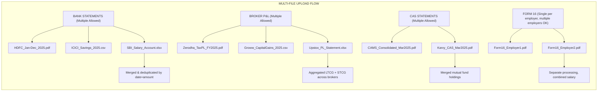
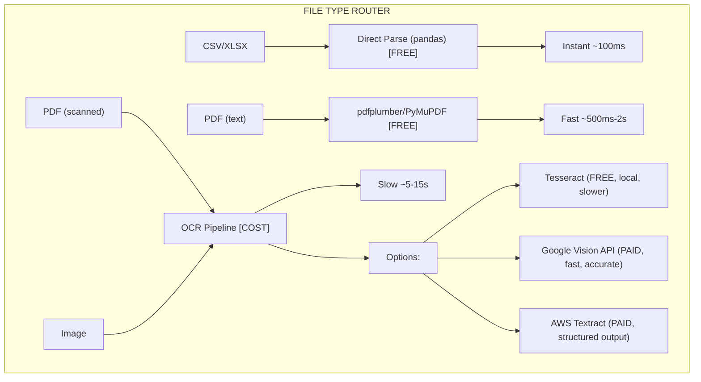
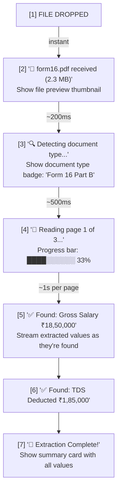
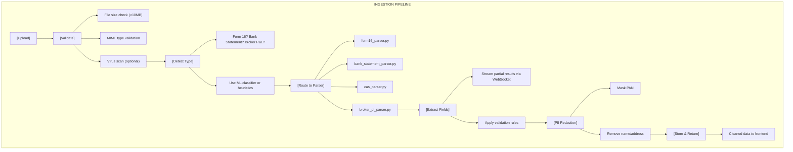
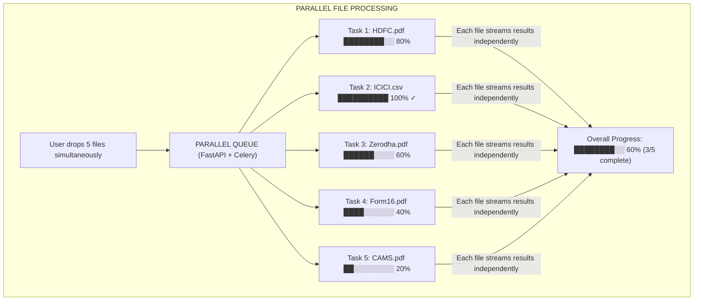

# Document Ingestion Architecture
Goal: Parse financial documents fast, accurately, cost-effectively, with progressive UX feedback

## 1. Supported File Formats & Limits
### Document Types
| Document | Formats | Max Size | Priority | Multi-File |
| :--- | :--- | :--- | :--- | :--- |
| Form 16 | PDF (text-based, scanned) | 5 MB | 🔴 Critical | ❌ Single (per employer) |
| Bank Statement | CSV, PDF, XLS/XLSX | 10 MB | 🔴 Critical | ✅ Multiple banks |
| CAS Statement | PDF | 5 MB | 🔴 Critical | ✅ Multiple (CAMS/Karvy) |
| Broker P&L | PDF, CSV, XLSX | 10 MB | 🔴 Critical | ✅ Multiple brokers |
| Rent Receipts | PDF, JPG, PNG | 2 MB each | 🟡 Medium | ✅ Multiple months |

### Multi-File Upload Requirements


### Total Upload Limits
| Limit | Value |
| :--- | :--- |
| Max files per upload | 20 |
| Max total size | 50 MB |
| Max per category | 10 files |

### Format Decision Matrix


## 2. Parsing Strategy: Speed vs Cost vs Accuracy
### Tiered Approach (Recommended)
#### TIER 1: LOCAL FREE PARSING (Default)
- CSV/XLSX → pandas (instant)
- Text PDF → pdfplumber (fast)
- **Cost**: ₹0

#### TIER 2: LOCAL OCR (Fallback for scanned)
- pytesseract + pdf2image
- **Speed**: 5-15 seconds per page
- **Accuracy**: 85-92% (depends on scan quality)
- **Cost**: ₹0 (runs on server)

#### TIER 3: CLOUD OCR (Premium/Complex cases)
- Google Document AI or Vision API
- **Speed**: 2-5 seconds
- **Accuracy**: 95-99%
- **Cost**: ~₹1-3 per page

### Cost Comparison
| Method | Speed | Accuracy | Cost/Document |
| :--- | :--- | :--- | :--- |
| pandas (CSV) | ⚡ Instant | 100% | ₹0 |
| pdfplumber (text PDF) | ⚡ Fast | 99% | ₹0 |
| Tesseract (scanned) | 🐢 Slow | 85-92% | ₹0 |
| Google Vision | ⚡ Fast | 98% | ~₹2-5 |
| AWS Textract | ⚡ Fast | 97% | ~₹5-10 |

**Recommendation:** Start with LOCAL FREE (Tier 1 + Tier 2), upgrade to Cloud OCR only for failed parses.

## 3. Progressive Parsing UX (Critical for Time Perception)
The Problem: PDF parsing takes 2-15 seconds. Users feel anxious if waiting with no feedback.

### Solution: Progressive Disclosure


### Key UX Principles
- **Immediate Acknowledgment (< 100ms)**: File received, show thumbnail.
- **Progress Visibility (Nielsen Heuristic #1)**: Page-by-page progress, percentage complete.
- **Streaming Results (Reduces perceived wait)**: Show extracted values AS they're found.
- **Gamification**: Counter: "Found 5 of ~12 fields", checkmarks for each section.
- **Fallback with Explanation**:
  - If OCR needed: "📷 Scanned PDF detected, using advanced OCR..."
  - If slow: "Large file, this may take 30 seconds..."

## 4. Backend Architecture
### API Design
```python
# Endpoints
POST /api/v1/ingest/upload
  → Returns: { task_id, status: "processing" }

GET /api/v1/ingest/status/{task_id}
  → Returns: { 
      status: "extracting",
      progress: 45,
      current_step: "Reading page 2 of 4",
      partial_results: { gross_salary: 1850000 }
    }

# WebSocket (for real-time updates)
WS /api/v1/ingest/stream/{task_id}
  → Streams: { field: "hra", value: 370000 }
```

### Processing Pipeline


### Tech Stack
| Component | Library | Why |
| :--- | :--- | :--- |
| PDF Text Extraction | pdfplumber | Best for structured PDFs |
| PDF Fallback | PyMuPDF (fitz) | Fast, handles edge cases |
| OCR (Local) | pytesseract | Free, decent accuracy |
| OCR (Cloud) | Google Vision API | Premium accuracy |
| CSV/XLSX | pandas | Industry standard |
| Async Processing | Celery or FastAPI BackgroundTasks | Non-blocking |
| Real-time Updates | WebSocket or SSE | Streaming feedback |

## 5. Frontend UX Recommendations
### Upload Experience
```tsx
// Component: ProgressiveUploadCard
<UploadCard>
  {/* Phase 1: File Received */}
  <FilePreview file={file} />
  <Badge>Form 16 Part B</Badge>
  
  {/* Phase 2: Processing */}
  <ProgressBar value={45} />
  <StatusText>Reading page 2 of 4...</StatusText>
  
  {/* Phase 3: Streaming Results */}
  <ExtractedFieldsList>
    <Field name="Gross Salary" value="₹18,50,000" status="found" />
    <Field name="Basic" value="₹9,25,000" status="found" />
    <Field name="HRA" value="..." status="extracting" />
    <Field name="TDS" value="..." status="pending" />
  </ExtractedFieldsList>
  
  {/* Phase 4: Complete */}
  <SuccessBanner>✅ Extraction Complete</SuccessBanner>
</UploadCard>
```

### Skeleton Loading Pattern
Show expected fields as skeletons, fill them in as data streams.

### Time Estimation
Show estimated time based on file type/size.

## 6. Multi-File Upload UX & Aggregation
### Parallel Processing Strategy


### Backend: Multi-File API
```python
# Multi-file upload endpoint
POST /api/v1/ingest/batch
  Body: FormData with multiple files
  → Returns: {
      batch_id: "batch_123",
      tasks: [
        { task_id: "t1", filename: "HDFC.pdf", category: "bank_statement" },
        { task_id: "t2", filename: "Zerodha.pdf", category: "broker_pl" },
      ]
    }

# Batch status endpoint
GET /api/v1/ingest/batch/{batch_id}/status
  → Returns: {
      overall_progress: 60,
      tasks: [
        { task_id: "t1", status: "complete", progress: 100 },
        { task_id: "t2", status: "processing", progress: 45 },
      ],
      aggregated: {
        bank_statements: { total_credits: 3450000, transactions: 777 },
        broker_pl: { ltcg: 80000, stcg: 45000 },
      }
    }
```

### Aggregation Logic
- **Bank Statement**: Merge, deduplicate by (date, amount, description), and categorize.
- **Broker P&L**: Sum LTCG/STCG, handle losses, and list brokers.
- **Form 16**: Combine salaries from multiple employers for total income.

## 7. Cost Optimization Strategies
1. **Local-First Processing**: Priority: pandas → pdfplumber → tesseract → Cloud OCR.
2. **Lazy OCR**: Only invoke cloud OCR if local extraction fails.
3. **Caching**: Cache extraction results by file hash.
4. **Compression**: Compress images before OCR.
5. **Batch Processing**: For large documents, process in chunks and stream.

## 8. Error Handling & Human Feedback Loop
### Confidence Scoring
```python
class ExtractionResult:
    value: str
    confidence: float  # 0.0 - 1.0
    source: str        # "text_extract", "ocr", "ml_inferred"
    needs_review: bool # True if confidence < 0.8
```

### Low Confidence UI
Highlight values that need verification and allow manual entry.

## 9. Implementation Phases
- **Phase A: MVP (3 days)**: Form 16 text PDF parser, Bank CSV parser, Basic feedback.
- **Phase B: Enhanced (3 days)**: Bank PDF parser, Local OCR, WebSocket streaming, Confidence scoring.
- **Phase C: Polish (2 days)**: CAS/Broker P&L parsers, Cloud OCR fallback, Human feedback loop.

## 10. File Structure
```
backend/app/
├── ingestion/
│   ├── __init__.py
│   ├── router.py           # FastAPI endpoints
│   ├── pipeline.py         # Main orchestrator
│   ├── parsers/
│   │   ├── base.py         # Base parser class
│   │   ├── form16.py       # Form 16 parser
│   │   ├── bank_statement.py
│   │   ├── cas.py
│   │   └── broker_pl.py
│   ├── extractors/
│   │   ├── pdf_text.py     # pdfplumber
│   │   ├── ocr_local.py    # Tesseract
│   │   └── ocr_cloud.py    # Google Vision
│   ├── validators/
│   │   └── schemas.py      # Pydantic models
│   └── utils/
│       ├── file_type.py    # MIME detection
│       └── pii_mask.py     # PAN masking
```
