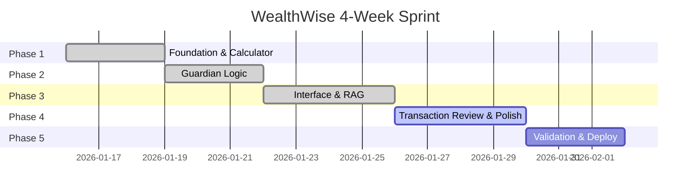

# WealthWise AI - Project Plan (4-Week Sprint)
> **Target**: January Rescue MVP | **FY**: 2025-26  
> **Last Updated**: 2026-01-16

---

## 1. Team Structure & Responsibilities

| Role | Responsibility | Key Deliverable |
|------|----------------|-----------------|
| **Product Manager** | Scope & Validation | `PROJECT_REQUIREMENTS.md`, `TEST_SCENARIOS.md` |
| **AI Engineer (Backend)** | Logic & RAG | `STRATEGY_CORE.md` implementation, `guardians/` logic |
| **Data Engineer** | Pipelines | `data/glossary.json`, OCR Parsers, Vector DB |
| **Frontend Engineer** | UI/UX | Dashboard, Document Hub, Transaction Review |
| **QA Engineer** | Testing | Validation against `rohan_synthetic_data.csv` |

---

## 2. Phase-wise Implementation Plan



---

### Phase 1: The Foundation ✅ (Complete)
**Goal**: A working Calculator that handles the "Math" perfectly

| Task | Owner | Status |
|------|-------|--------|
| Build `engine/calculator.py` using `TAX_RULES_CONSTANTS.md` | Backend | ✅ Done |
| Ingest Tier 1 Legal Docs (JSONLs) into ChromaDB | Data | ✅ Done |
| Create `glossary.json` | Data | ✅ Done |
| Finalize "Rohan" Synthetic Dataset | PM | ✅ Done |

**✅ Checkpoint**: `calculator.calculate_tax(1210000)` returns `₹10,000` (Marginal Relief)

---

### Phase 2: The Guardians ✅ (Complete)
**Goal**: Activate the 4 Agents to handle income streams

| Agent | File | Status |
|-------|------|--------|
| Salary Sentinel | `sentinel_salary.py` | ✅ Done |
| Portfolio Architect | `architect_portfolio.py` | ✅ Done |
| Hustle Shield | `shield_hustle.py` | ✅ Done |
| Windfall Warden | `warden_windfall.py` | ✅ Done |

**✅ Checkpoint**: System correctly flags "Crypto Loss" as Dead Loss

---

### Phase 3: The Interface & RAG ✅ (Complete)
**Goal**: Connect the Logic to the User

| Task | Owner | Status |
|------|-------|--------|
| Landing Page with terminal preview | Frontend | ✅ Done |
| Onboarding (Guardian Selection) | Frontend | ✅ Done |
| Twin Dashboard (Old vs New Regime) | Frontend | ✅ Done |
| CA Companion Chatbot | AI Engineer | ✅ Done |
| Connect RAG Pipeline | AI Engineer | ✅ Done |

**✅ Checkpoint**: User can select Guardians and see regime comparison

---

### Phase 4: Transaction Review & Polish ✅ (Complete)
**Goal**: Complete user feedback loop for transaction classification

| Task | Owner | Status |
|------|-------|--------|
| **Document Hub Page** (block-based upload) | Frontend | ✅ Done |
| **Transaction Review Page** (feedback loop) | Frontend | ✅ Done |
| Apply Nielsen's 10 Heuristics audit | UX | ✅ Done |
| Add keyboard shortcuts (B/P/G/U) | Frontend | ✅ Done |
| Mouse-clickable classification buttons | Frontend | ✅ Done |
| **Demo Mode** (full flow with sample data) | Frontend | ✅ Done |

**New Components Added:**
- `/ingest` - Document Hub with all upload blocks visible
- `/review` - Transaction classification feedback loop
- AI Confidence thresholds: 90%/60%/0%

**✅ Checkpoint**: User can review and classify ambiguous transactions

---

### Phase 5: Validation & Deploy 🔄 (In Progress)
**Goal**: Demo Day Readiness

| Task | Owner | Status |
|------|-------|--------|
| Run `TEST_SCENARIOS.md` against full build | QA | ✅ Done (13/13) |
| Verify "Jan Rescue" Narrative | PM | ⏳ Pending |
| Form 12BB generation | Backend | ⏳ Pending |
| Set up "Session Wipe" cron job | DevOps | ⏳ Pending |
| Bug fixes & Performance tuning | All | ⏳ Pending |

**Test Results (Jan 16, 2026)**:
```
tests/unit/math_engine/test_calculator.py ... 13 passed ✓
- Section 87A marginal relief: ✓
- LTCG/STCG calculations: ✓
- Crypto trap (115BBH): ✓
- Regime comparison: ✓
```

**✅ Final Output**: Deployable URL

---

## 3. New Additions (Jan 16 Update)

### 3.1 CA Companion Chatbot
- RAG-powered legal knowledge
- Context-aware (knows user's data)
- Tool access (recalculate_tax, search_tax_law)
- Safety guardrails (refuses evasion queries)

### 3.2 Document Hub (Block-Based)
- All upload blocks visible at once
- User can prepare all documents upfront
- Progress tracking across all sources
- Applies Heuristic #1 (Visibility) and #6 (Recognition)

### 3.3 Transaction Review Page
- AI confidence scoring (auto/review/must-review)
- User classification with keyboard shortcuts
- Bulk actions for efficiency
- "Unsure - Ask CA" option
- Applies Heuristic #5 (Error Prevention) and #9 (Error Recovery)

### 3.4 Nielsen Heuristics Integration
All UI components audited against 10 usability heuristics:
1. Visibility of System Status ✅
2. Match System & Real World ✅
3. User Control & Freedom ✅
4. Consistency & Standards ✅
5. Error Prevention ✅
6. Recognition over Recall ✅
7. Flexibility & Efficiency 🔄
8. Aesthetic & Minimalist Design ✅
9. Help Users Recover from Errors 🔄
10. Help & Documentation ✅

---

## 4. Risk Register

| Risk | Probability | Impact | Mitigation |
|------|-------------|--------|------------|
| Tax rule misinterpretation | Low | Critical | Cross-validate with CA |
| OCR accuracy issues | Medium | High | Manual fallback entry |
| AI over-confidence in classification | Medium | Medium | User review for <90% confidence |
| User overwhelm at Document Hub | Low | Medium | Show clear instructions, optional sections |
| Session timeout during classification | Low | Medium | Auto-save progress, resume option |

---

## 5. Definition of Done

| Criteria | Validation |
|----------|------------|
| All guardians produce correct findings | Unit tests pass |
| Tax calculation matches manual verification | Within ₹10 tolerance |
| User can complete full flow in <10 minutes | Timed test |
| Transaction review handles 200+ items | Performance test |
| Keyboard shortcuts work | Accessibility test |
| Chatbot refuses evasion queries | Safety test |
| Form 12BB generates correctly | Output validation |

---

## 6. Updated File Structure

```
wealthwise/
├── frontend/
│   └── src/
│       └── app/
│           ├── page.tsx           # Landing
│           ├── onboarding/        # Guardian selection
│           ├── ingest/            # Document Hub (NEW: block-based)
│           ├── review/            # Transaction Review (NEW)
│           └── dashboard/         # Twin-Engine + Guardians
└── backend/
    └── app/
        ├── chat_engine/           # CA Companion (NEW)
        │   ├── agent.py
        │   ├── safety.py
        │   ├── memory.py
        │   └── tools.py
        └── api/endpoints/
            ├── audit.py
            ├── calculator.py
            └── chat.py            # Chat API (NEW)
```