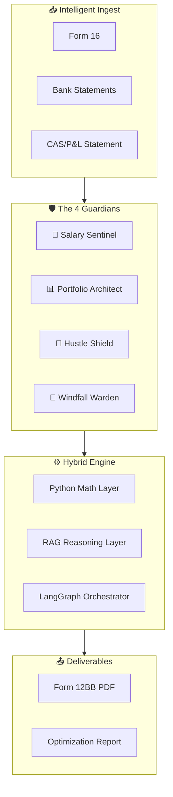

# WealthWise AI - Product Requirements Document
> **Version**: 2.1 (The "Vibe Coded" Stack) | **FY**: 2025-26 (AY 2026-27)  
> **Target Persona**: "The Modern Moonlighter"

---

## Executive Summary

### Vision
> *"Use your Past (Form 16/AIS) to Fix your Future (Form 12BB)."*

WealthWise AI is an **Agentic Tax Optimization Engine** designed for modern Indian professionals with multiple income streams. Unlike traditional tax filing tools that isolate income heads, WealthWise employs a **"Multi-Agent" architecture** where four distinct "Guardians" analyze specific aspects of a user's financial life in parallel.

### Key Differentiator
| Component | Purpose |
|-----------|---------|
| **Deterministic Math** | 100% accurate calculations (No AI guessing) |
| **RAG Intelligence** | Explains *why* with legal citations |
| **Strategic Optimization** | Structurally re-engineers income |

---

## The 4 Guardians Architecture



### Guardian Details

#### Agent 1: The Salary Sentinel
**Target**: Employees with Form 16

| Scope | Key Optimizations |
|-------|------------------|
| Basic Pay, HRA, LTA, Perquisites | **NPS Arbitrage**: Validate 80CCD(2) - 14% employer contribution |
| | **EV Lease**: Simulate Rule 3 perquisite (Lease vs Loan) |
| | **Regime Selection**: Old vs New based on rent & loan data |

#### Agent 2: The Portfolio Architect
**Target**: Stock Traders, MF Investors, Crypto Users

| Scope | Key Optimizations |
|-------|------------------|
| STCG/LTCG, Dividends, VDA | **Harvesting**: Alert for ₹1.25L LTCG exemption (112A) |
| | **Buyback Trap**: Warn against buybacks (30%) vs market (12.5%) |
| | **Crypto Guard**: Enforce "No Set-off" rule (115BBH) |

#### Agent 3: The Hustle Shield
**Target**: Freelancers, Consultants, Gig Workers

| Scope | Key Optimizations |
|-------|------------------|
| Domestic & Foreign Remittances | **44ADA**: Apply 50% flat profit if < ₹75L |
| | **Audit Check**: Monitor GST (>₹20L) & Audit limits |

#### Agent 4: The Windfall Warden
**Target**: Landlords, Beneficiaries of Gifts/Inheritance

| Scope | Key Optimizations |
|-------|------------------|
| Rent, Interest, Family Transfers | **Rent Automation**: Auto-apply 30% deduction (Sec 24) |
| | **Clubbing Guard**: Validate HUF sources (Sec 64(2)) |
| | **Gift Filter**: Relative (exempt) vs Non-relative (taxable >₹50k) |

---

## Scope & Exclusions

### In-Scope (MVP)
- ✅ Individuals Only (Status: Individual/HUF)
- ✅ Residential Status: Resident & Ordinarily Resident (ROR)
- ✅ Income Heads: Salary, House Property, Capital Gains, PGBP (Presumptive), Other Sources

### Out-of-Scope (Strictly Excluded)
- ❌ Lane 4 (Biz Owners): No Audited Balance Sheets, No Inventory, No 43B(h)
- ❌ Non-Residents: No NRI taxation logic
- ❌ Carry Forward Losses: Current year set-off only for MVP

---

## Functional Requirements

### Module A: The "Stacked" Onboarding (Identity Sieve)

**Input**: Multi-select checkboxes  
```
[x] Salaried  [x] Stocks/Crypto  [x] Freelancing  [ ] Rent/Other
```

**Logic**: Dynamically generate upload slots:
- Freelance selected → Request Bank Statement
- Stocks selected → Request CAS/P&L Statement

### Module B: Intelligent Ingest & Classification

| Parser | Extracts |
|--------|----------|
| `Form16_Parser` | Gross Salary, Exemptions (Sec 10) |
| `Broker_Parser` | Realized P&L, Holdings |
| `Bank_Parser` | Credits, Debits |

**Human-in-the-Loop Modal**:  
- Trigger: Agent 3 (Hustle) active AND ambiguous credit >₹20k
- Action: Present modal for user classification
- Choices: `Business Income` | `Personal Transfer` | `Refund`

### Module C: The "Hybrid" Logic Engine

| Layer | Responsibility |
|-------|----------------|
| **Math Layer (Python)** | ALL tax calculations - slabs, surcharge, cess, rebate 87A |
| **Reasoning Layer (RAG)** | Explain the math with legal citations |
| **Orchestrator (LangGraph)** | Coordinate Guardian workflows |

> [!CAUTION]
> **NO LLM MATH**. Tax calculations must be 100% deterministic Python.

### Module D: The Regime Showdown

Calculate tax under **three scenarios**:

| Scenario | Description |
|----------|-------------|
| Old Regime | With HRA, 80C, 80D |
| New Regime (Default) | With Std Deduction, 80CCD(2) |
| New Regime (Optimized) | Simulating salary restructure |

**Output**: "Switching to [Winner] saves you ₹[Amount]."

### Module E: Deliverables Generator

| Output | Description |
|--------|-------------|
| **Form 12BB** | Auto-filled PDF for employer |
| **Optimization Report** | Checklist of actions |

---

## Technical Architecture

| Layer | Technology | Role |
|-------|------------|------|
| Frontend | Next.js + Tailwind + Shadcn/UI | Pixel-perfect "Fiscal Clarity" theme |
| Backend | FastAPI (Python) | REST API, calculator & guardians logic |
| Orchestration | LangGraph | State transfer between Guardians |
| Vector DB | ChromaDB | Legal docs & glossary for RAG |
| Session DB | SQLite | User data (wiped post-session) |

### Security

| Requirement | Implementation |
|-------------|----------------|
| PII Redaction | Microsoft Presidio on ingest |
| Data Retention | Zero-retention (RAM/Session only) |
| Session Wipe | Cron job after 30 min inactivity |

---

## Data Logic (The "Steel Thread")

| Guardian | Input Data | Processing Logic | Output Field |
|----------|-----------|------------------|--------------|
| Sentinel | Form 16 (Gross) | `calculator.py` (Slabs) | Taxable Salary |
| Hustle | Bank Credit ("Upwork") | User Tag → 50% Flat Profit | Biz Income (44ADA) |
| Portfolio | Broker P&L (LTCG) | If <₹1.25L → Tax=0, Else 12.5% | Capital Gains Tax |
| Warden | Rent Received | Apply 30% Deduction (Sec 24) | House Property Income |
| **CORE** | Total Income | Regime Comparator | **Final Tax Liability** |

---

## Non-Functional Requirements

| Requirement | Target |
|-------------|--------|
| **Accuracy** | Math engine passes "Marginal Relief" test (₹12.10L → Tax ₹10k) with 100% consistency |
| **Latency** | Analysis pipeline < 30 seconds |
| **Privacy** | No user data stored on disk after session termination |

---

## Glossary

| Term | User-Friendly Name |
|------|-------------------|
| Sec 44ADA | "Presumptive Shield" |
| Sec 112A | "Harvesting Limit" |
| Sec 43B(h) | "MSME Guard" |
| Sec 115BBH | "Crypto Trap" |