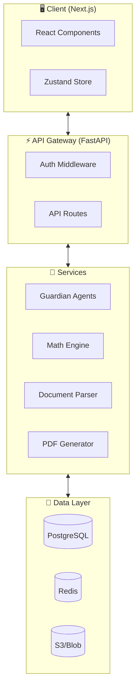

# WealthWise AI - Software Requirements Specification
> **Version**: 1.0 | **Target**: January Rescue MVP

---

## 1. System Overview

### Architecture


---

## 2. Functional Requirements

### 2.1 Authentication (FR-AUTH)

| ID | Requirement | Priority |
|----|-------------|----------|
| FR-AUTH-01 | User can register with email/password | 🔴 Critical |
| FR-AUTH-02 | User can login with credentials | 🔴 Critical |
| FR-AUTH-03 | Session expires after 30 min inactivity | 🟡 High |
| FR-AUTH-04 | Password reset via email | 🟢 Medium |

### 2.2 Onboarding - Identity Sieve (FR-ONBOARD)

| ID | Requirement | Priority |
|----|-------------|----------|
| FR-ONBOARD-01 | Dynamic questionnaire based on income sources | 🔴 Critical |
| FR-ONBOARD-02 | Activate relevant Guardians based on answers | 🔴 Critical |
| FR-ONBOARD-03 | Save progress and allow resume | 🟡 High |
| FR-ONBOARD-04 | Validate answers before proceeding | 🟡 High |

### 2.3 Document Ingestion (FR-INGEST)

| ID | Requirement | Priority |
|----|-------------|----------|
| FR-INGEST-01 | Parse Form 16 PDF (OCR) | 🔴 Critical |
| FR-INGEST-02 | Parse Bank Statement CSV | 🔴 Critical |
| FR-INGEST-03 | Parse Bank Statement PDF (OCR) | 🟡 High |
| FR-INGEST-04 | Parse CAS Statement PDF | 🟡 High |
| FR-INGEST-05 | Manual input fallback for each field | 🟡 High |
| FR-INGEST-06 | Validate extracted data with user | 🔴 Critical |

### 2.4 Guardian Analysis (FR-GUARD)

| ID | Requirement | Priority |
|----|-------------|----------|
| FR-GUARD-01 | Salary Sentinel: Analyze NPS, EV, HRA | 🔴 Critical |
| FR-GUARD-02 | Portfolio Architect: Analyze investments | 🔴 Critical |
| FR-GUARD-03 | Hustle Shield: Analyze freelance income | 🔴 Critical |
| FR-GUARD-04 | Windfall Warden: Analyze rent/gifts | 🔴 Critical |
| FR-GUARD-05 | Generate optimization recommendations | 🔴 Critical |
| FR-GUARD-06 | Flag audit risks with explanations | 🟡 High |

### 2.5 Math Engine (FR-MATH)

| ID | Requirement | Priority |
|----|-------------|----------|
| FR-MATH-01 | Calculate tax under Old Regime | 🔴 Critical |
| FR-MATH-02 | Calculate tax under New Regime | 🔴 Critical |
| FR-MATH-03 | Apply Section 87A rebate correctly | 🔴 Critical |
| FR-MATH-04 | Apply Marginal Relief at cliff | 🔴 Critical |
| FR-MATH-05 | Calculate surcharge and cess | 🔴 Critical |
| FR-MATH-06 | Compare regimes and recommend optimal | 🔴 Critical |

### 2.6 Output Generation (FR-OUTPUT)

| ID | Requirement | Priority |
|----|-------------|----------|
| FR-OUTPUT-01 | Generate Form 12BB PDF | 🔴 Critical |
| FR-OUTPUT-02 | Generate Optimization Report | 🟡 High |
| FR-OUTPUT-03 | Download PDFs from dashboard | 🔴 Critical |
| FR-OUTPUT-04 | Email PDF to user (optional) | 🟢 Low |

---

## 3. Non-Functional Requirements

### 3.1 Performance (NFR-PERF)

| ID | Requirement | Target |
|----|-------------|--------|
| NFR-PERF-01 | Page load time | < 2 seconds |
| NFR-PERF-02 | API response time (95th percentile) | < 500ms |
| NFR-PERF-03 | Document parsing time | < 30 seconds |
| NFR-PERF-04 | PDF generation time | < 5 seconds |

### 3.2 Security (NFR-SEC)

| ID | Requirement | Implementation |
|----|-------------|----------------|
| NFR-SEC-01 | Data encryption at rest | AES-256 |
| NFR-SEC-02 | Data encryption in transit | TLS 1.3 |
| NFR-SEC-03 | PII handling compliance | Minimal retention |
| NFR-SEC-04 | Input sanitization | All user inputs |
| NFR-SEC-05 | Rate limiting | 100 req/min/user |

### 3.3 Reliability (NFR-REL)

| ID | Requirement | Target |
|----|-------------|--------|
| NFR-REL-01 | Uptime | 99.5% |
| NFR-REL-02 | Tax calculation accuracy | 100% |
| NFR-REL-03 | Graceful error handling | All failures |

---

## 4. API Specification

### Base URL
```
Production: https://api.wealthwise.ai/v1
Staging: https://staging-api.wealthwise.ai/v1
```

### Endpoints

#### Authentication
| Method | Endpoint | Description |
|--------|----------|-------------|
| POST | `/auth/register` | Create account |
| POST | `/auth/login` | Login, returns JWT |
| POST | `/auth/logout` | Invalidate session |

#### Onboarding
| Method | Endpoint | Description |
|--------|----------|-------------|
| GET | `/onboarding/questions` | Get dynamic questions |
| POST | `/onboarding/submit` | Submit answers, activate guardians |

#### Documents
| Method | Endpoint | Description |
|--------|----------|-------------|
| POST | `/documents/upload` | Upload document for parsing |
| GET | `/documents/{id}/status` | Check parsing status |
| GET | `/documents/{id}/data` | Get extracted data |
| PUT | `/documents/{id}/data` | Update/correct data |

#### Analysis
| Method | Endpoint | Description |
|--------|----------|-------------|
| POST | `/analysis/run` | Trigger guardian analysis |
| GET | `/analysis/{id}/status` | Check analysis status |
| GET | `/analysis/{id}/results` | Get optimization findings |

#### Tax Calculation
| Method | Endpoint | Description |
|--------|----------|-------------|
| POST | `/tax/calculate` | Calculate tax both regimes |
| POST | `/tax/compare` | Regime comparison |
| POST | `/tax/optimize` | Apply optimizations |

#### Output
| Method | Endpoint | Description |
|--------|----------|-------------|
| POST | `/output/form12bb` | Generate Form 12BB PDF |
| GET | `/output/form12bb/{id}` | Download Form 12BB |
| POST | `/output/report` | Generate optimization report |

---

## 5. Data Models

### User Profile
```typescript
interface UserProfile {
  id: string;
  email: string;
  createdAt: Date;
  onboardingComplete: boolean;
  activeGuardians: GuardianType[];
  assessmentYear: string; // "2026-27"
}

type GuardianType = 
  | "salary_sentinel"
  | "portfolio_architect"
  | "hustle_shield"
  | "windfall_warden";
```

### Tax Calculation Result
```typescript
interface TaxResult {
  regime: "old" | "new";
  grossIncome: number;
  deductions: DeductionBreakdown;
  taxableIncome: number;
  taxBeforeRebate: number;
  rebate87A: number;
  surcharge: number;
  cess: number;
  totalTax: number;
}
```

---

## 6. Error Codes

| Code | Message | HTTP Status |
|------|---------|-------------|
| E1001 | Invalid credentials | 401 |
| E1002 | Session expired | 401 |
| E2001 | Document parsing failed | 422 |
| E2002 | Unsupported file format | 400 |
| E3001 | Calculation error | 500 |
| E4001 | PDF generation failed | 500 |