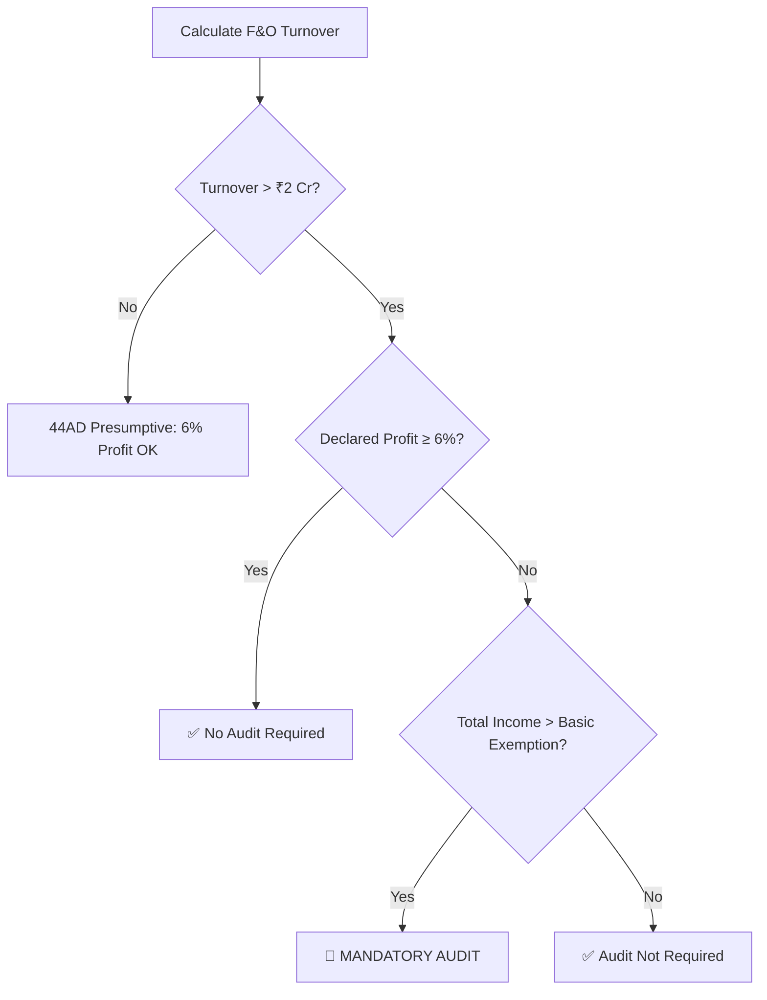

# WealthWise AI - Strategy Core
> **Context**: Logic & Optimization Algorithms (FY 2025-26)  
> **Purpose**: Defines the "Thinking Process" for the Math Engine and 4 Guardians

---

## 1. The "Zero Tax" Engine (Section 87A)

**Goal**: Maximize the New Regime Rebate.

### Thresholds
| Condition | Result |
|-----------|--------|
| Net Taxable Income ≤ ₹12,00,000 | Tax Liability = **₹0** |
| Income > ₹12,00,000 | Apply Marginal Relief |

### The "Cliff" Logic (Marginal Relief)

**Problem**: Income of ₹12,01,000 creates tax of ~₹90,000 (absurd jump).

**Solution**: Apply Marginal Relief to cap tax at excess amount.

```python
def calculate_tax_with_marginal_relief(income: float) -> float:
    """
    Apply Section 87A rebate with marginal relief for cliff protection.
    Applicable for New Regime FY 2025-26.
    """
    REBATE_THRESHOLD = 12_00_000
    RELIEF_CEILING = 12_75_000  # Beyond this, normal tax applies
    
    if income <= REBATE_THRESHOLD:
        return 0  # Full rebate
    
    if income > REBATE_THRESHOLD and income <= RELIEF_CEILING:
        base_tax = calculate_slab_tax(income)
        excess_income = income - REBATE_THRESHOLD
        return min(base_tax, excess_income)  # Marginal relief
    
    return calculate_slab_tax(income)  # Normal tax
```

---

## 2. Portfolio Architect Logic (Investments)

### A. Buyback Shift (⚠️ Crucial FY26 Update)

| Aspect | Old Rule | New Rule (FY26) |
|--------|----------|-----------------|
| Classification | Capital Gains | Deemed Dividend - Sec 2(22)(f) |
| Tax Rate | 10-20% | **Slab Rate (up to 30%)** |

**Optimization Logic**:
```python
def should_participate_in_buyback(user_slab_rate: float) -> dict:
    LTCG_RATE = 0.125  # 12.5%
    
    if user_slab_rate > LTCG_RATE:
        return {
            "action": "AVOID_BUYBACK",
            "reason": f"Sell on open market. Pay {LTCG_RATE*100}% instead of {user_slab_rate*100}%",
            "savings": f"{(user_slab_rate - LTCG_RATE) * 100}% per transaction"
        }
    return {"action": "BUYBACK_OK", "reason": "Slab rate ≤ LTCG rate"}
```

### B. F&O Turnover Calculation (Audit Trigger)

**Why**: F&O = Non-Speculative Business Income. Audit depends on turnover.

**Formula**: 
```
Turnover = Σ(|Profit_per_trade| + |Loss_per_trade|)
```

**Compliance Decision Tree**:


### C. Crypto (VDA) Guardrails - Section 115BBH

| Rule | Value |
|------|-------|
| Tax Rate | Flat **30% + 4% Cess** |
| Set-off | ❌ **STRICTLY NO** |
| Deductible Costs | Purchase price only |

**Hard Rules**:
- ❌ Crypto Loss **cannot** offset Crypto Gain
- ❌ Crypto Loss **cannot** offset Salary/Business Income
- ❌ Exchange fees, Gas fees are **NOT deductible**

```python
def calculate_crypto_tax(gains: float, losses: float) -> dict:
    """Crypto losses cannot be set off - Section 115BBH"""
    TAX_RATE = 0.30
    CESS = 0.04
    
    # Losses are IGNORED - no set-off allowed
    taxable_gains = max(gains, 0)  # Only positive gains taxed
    base_tax = taxable_gains * TAX_RATE
    total_tax = base_tax * (1 + CESS)
    
    return {
        "taxable_gains": taxable_gains,
        "losses_ignored": losses,  # Cannot use these
        "tax_payable": total_tax
    }
```

### D. Loss Harvesting (Section 112A) - LTCG Optimization

**Goal**: Realize ₹1,25,000 LTCG annually (tax-free threshold).

```python
def loss_harvesting_recommendation(
    unrealized_ltcg: float,
    unrealized_losses: float,
    realized_ltcg_ytd: float
) -> dict:
    LTCG_EXEMPTION = 1_25_000
    remaining_exemption = LTCG_EXEMPTION - realized_ltcg_ytd
    
    if remaining_exemption > 0 and unrealized_ltcg > 0:
        harvest_amount = min(unrealized_ltcg, remaining_exemption)
        return {
            "action": "HARVEST_GAINS",
            "amount": harvest_amount,
            "reason": f"Book ₹{harvest_amount:,.0f} LTCG tax-free before March 31"
        }
    
    if unrealized_losses > 0:
        return {
            "action": "HARVEST_LOSSES",
            "amount": unrealized_losses,
            "reason": "Book losses to offset future LTCG"
        }
    
    return {"action": "HOLD", "reason": "No optimization opportunity"}
```

---

## 3. Salary Sentinel Logic (Restructuring)

### A. EV Arbitrage (Rule 3 Perquisites)

**Concept**: Company leases EV → Employee uses it → Minimal perquisite value.

| Route | Tax Treatment |
|-------|---------------|
| Loan Route | Employee pays EMI from **Post-Tax** salary |
| Lease Route | Company pays from **Pre-Tax**. Perquisite ≈ ₹1,800/mo |

**Trigger Logic**:
```python
def recommend_ev_structure(marginal_tax_rate: float, monthly_emi: float) -> dict:
    PERQUISITE_VALUE = 1800  # Approx monthly
    
    if marginal_tax_rate > 0.20:
        tax_on_emi = monthly_emi * marginal_tax_rate
        tax_on_lease = PERQUISITE_VALUE * marginal_tax_rate
        monthly_savings = tax_on_emi - tax_on_lease
        
        return {
            "recommendation": "LEASE_ROUTE",
            "monthly_savings": monthly_savings,
            "annual_savings": monthly_savings * 12
        }
    return {"recommendation": "LOAN_OK", "reason": "Marginal rate ≤ 20%"}
```

### B. NPS "Tiered" Optimization

| Tier | Section | Limit | Priority |
|------|---------|-------|----------|
| Tier 2 (Corporate) | 80CCD(2) | 14% of (Basic + DA) | 🥇 **First** |
| Tier 1 (Personal) | 80CCD(1B) | ₹50,000 | 🥈 Second |

**Key Insight**: Tier 2 is **outside** the ₹1.5L + ₹50k limits. Always maximize first.

```python
def nps_optimization(basic_salary: float, da: float, current_80ccd2: float) -> dict:
    MAX_80CCD2_RATE = 0.14
    max_employer_contribution = (basic_salary + da) * MAX_80CCD2_RATE
    additional_possible = max_employer_contribution - current_80ccd2
    
    if additional_possible > 0:
        return {
            "action": "INCREASE_80CCD2",
            "additional_amount": additional_possible,
            "tax_saved": additional_possible * 0.30  # Assuming 30% slab
        }
    return {"action": "MAXIMIZE_80CCD1B", "limit": 50_000}
```

### C. HRA Exemption Calculation

```python
def calculate_hra_exemption(
    hra_received: float,
    basic_salary: float,
    da: float,
    rent_paid: float,
    is_metro: bool
) -> float:
    """
    HRA Exemption = MIN of:
    1. Actual HRA received
    2. 50% (metro) or 40% (non-metro) of (Basic + DA)
    3. Rent paid - 10% of (Basic + DA)
    """
    metro_rate = 0.50 if is_metro else 0.40
    
    option_1 = hra_received
    option_2 = (basic_salary + da) * metro_rate
    option_3 = rent_paid - (0.10 * (basic_salary + da))
    
    return max(0, min(option_1, option_2, option_3))
```

---

## 4. Hustle Shield Logic (Section 44ADA)

**For**: Freelancers & Professionals with receipts ≤ ₹75 Lakhs

### Presumptive Taxation Benefits

| Aspect | Value |
|--------|-------|
| Deemed Profit | **50%** of gross receipts |
| Books Required | ❌ No |
| Audit Required | ❌ No (if profit ≥ 50%) |

**Eligibility Check**:
```python
def check_44ada_eligibility(
    gross_receipts: float,
    profession_type: str,
    actual_expenses: float
) -> dict:
    ELIGIBLE_PROFESSIONS = [
        "legal", "medical", "engineering", "architecture",
        "accountancy", "technical_consultancy", "interior_decoration",
        "film_artist", "company_secretary", "authorized_representative"
    ]
    THRESHOLD = 75_00_000
    DEEMED_PROFIT_RATE = 0.50
    
    if profession_type.lower() not in ELIGIBLE_PROFESSIONS:
        return {"eligible": False, "reason": "Profession not in 44ADA list"}
    
    if gross_receipts > THRESHOLD:
        return {"eligible": False, "reason": f"Receipts exceed ₹{THRESHOLD:,}"}
    
    deemed_profit = gross_receipts * DEEMED_PROFIT_RATE
    actual_profit = gross_receipts - actual_expenses
    
    if actual_profit < deemed_profit:
        return {
            "eligible": True,
            "recommendation": "USE_44ADA",
            "tax_savings": (deemed_profit - actual_profit) * 0.30,
            "reason": "Deemed profit > actual profit. Use 44ADA!"
        }
    
    return {
        "eligible": True,
        "recommendation": "REGULAR_BOOKS",
        "reason": "Actual expenses give better deduction"
    }
```

---

## 5. Windfall Warden Logic (Rent & Gifts)

### A. Rental Income - Standard Deduction

| Deduction | Rate |
|-----------|------|
| Standard Deduction | **30%** of Net Annual Value |
| Municipal Taxes | Actual paid (deductible) |

```python
def calculate_rental_income_tax(
    gross_rent: float,
    municipal_taxes: float,
    home_loan_interest: float
) -> dict:
    STANDARD_DEDUCTION_RATE = 0.30
    
    nav = gross_rent - municipal_taxes  # Net Annual Value
    standard_deduction = nav * STANDARD_DEDUCTION_RATE
    taxable_income = nav - standard_deduction - home_loan_interest
    
    return {
        "gross_rent": gross_rent,
        "municipal_taxes_deducted": municipal_taxes,
        "standard_deduction": standard_deduction,
        "home_loan_interest_deducted": home_loan_interest,
        "taxable_rental_income": max(0, taxable_income)
    }
```

### B. Gift Taxation Rules

| Gift Type | Threshold | Tax Treatment |
|-----------|-----------|---------------|
| From relatives | Unlimited | ❌ Not taxable |
| From non-relatives | ≤ ₹50,000/year | ❌ Not taxable |
| From non-relatives | > ₹50,000/year | ✅ Fully taxable |
| On occasion of marriage | Unlimited | ❌ Not taxable |

**Relatives Defined**: Spouse, siblings, parents, in-laws, lineal ascendants/descendants.

```python
def validate_gift(
    amount: float,
    from_relative: bool,
    occasion: str = None
) -> dict:
    EXEMPTION_LIMIT = 50_000
    EXEMPT_OCCASIONS = ["marriage"]
    
    if from_relative:
        return {"taxable": False, "reason": "Gift from relative - exempt"}
    
    if occasion and occasion.lower() in EXEMPT_OCCASIONS:
        return {"taxable": False, "reason": f"Gift on {occasion} - exempt"}
    
    if amount <= EXEMPTION_LIMIT:
        return {"taxable": False, "reason": f"Below ₹{EXEMPTION_LIMIT:,} threshold"}
    
    return {
        "taxable": True,
        "taxable_amount": amount,  # Full amount, not excess
        "reason": "Gift from non-relative exceeds threshold"
    }
```

---

## 6. Surcharge Arbitrage (UHNI > ₹5 Cr)

| Regime | Surcharge | Effective Rate |
|--------|-----------|----------------|
| Old Regime | 37% | ~42.7% |
| New Regime | **Capped 25%** | ~39% |

**Hard Rule**:
```python
def force_regime_for_uhni(total_income: float) -> dict:
    UHNI_THRESHOLD = 5_00_00_000
    
    if total_income > UHNI_THRESHOLD:
        return {
            "forced_regime": "NEW",
            "reason": "3.7% surcharge arbitrage outweighs any deduction",
            "estimated_savings": total_income * 0.037
        }
    return {"forced_regime": None, "reason": "Below UHNI threshold"}
```

---

## 7. Income Characterization Matrix

> Defines how losses can be set-off across income heads.

| Income Source | Head | Tax Rate | Set-off Against |
|--------------|------|----------|-----------------|
| Salary | Income from Salary | Slab Rate | ❌ No loss possible |
| Buyback Proceeds | Income from Other Sources | Slab Rate | ❌ No cap gain set-off |
| Crypto/VDA | Sec 115BBH | Flat 30% | ❌ **ISOLATED** |
| Intraday Trading | Speculative Business | Slab Rate | ⚡ Only speculative income |
| F&O Trading | Non-Speculative Biz | Slab Rate | ✅ Any except Salary |
| Freelance (44ADA) | PGBP | Slab Rate | ✅ Any except Salary |
| Rental Income | House Property | Slab Rate | ✅ Any (₹2L limit for HP loss) |

---

## 8. Regime Comparison Engine

```python
def compare_regimes(
    gross_income: float,
    deductions_80c: float,
    deductions_80d: float,
    hra_exemption: float,
    other_deductions: float
) -> dict:
    """Compare Old vs New Regime to recommend optimal choice."""
    
    # Old Regime
    old_taxable = gross_income - deductions_80c - deductions_80d - hra_exemption - other_deductions
    old_tax = calculate_old_regime_tax(old_taxable)
    
    # New Regime (limited deductions)
    new_standard_deduction = 75_000
    new_taxable = gross_income - new_standard_deduction
    new_tax = calculate_new_regime_tax(new_taxable)
    
    winner = "OLD" if old_tax < new_tax else "NEW"
    savings = abs(old_tax - new_tax)
    
    return {
        "old_regime_tax": old_tax,
        "new_regime_tax": new_tax,
        "recommended": winner,
        "savings": savings,
        "breakeven_deductions": calculate_breakeven(gross_income)
    }
```

---

## Quick Reference: Guardian → Logic Mapping

| Guardian | Primary Logic Sections |
|----------|----------------------|
| **Salary Sentinel** | §3 (EV, NPS, HRA) |
| **Portfolio Architect** | §2 (Buyback, F&O, Crypto, Loss Harvesting) |
| **Hustle Shield** | §4 (44ADA Presumptive) |
| **Windfall Warden** | §5 (Rent, Gifts) |
| **Math Engine** | §1 (87A Cliff), §6 (Surcharge), §8 (Regime Compare) |