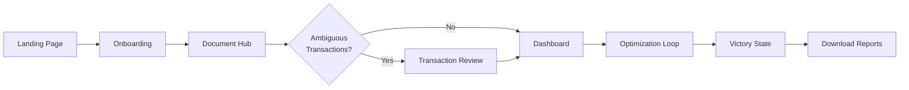

# UX_STRATEGY_CORE.md
> **Project**: WealthWise AI  
> **Core Philosophy**: The IKEA Effect + Usability-First Design  
> **Goal**: Transform the user from "Anxious Taxpayer" to "Financial Hero"

---

## 0. Nielsen's 10 Usability Heuristics (Foundation)

Every design decision must be validated against these principles:

| # | Heuristic | WealthWise Application |
|---|-----------|------------------------|
| 1 | **Visibility of System Status** | Processing logs, progress bars, Guardian status indicators |
| 2 | **Match System & Real World** | Use "Presumptive Shield" not "Sec 44ADA", ₹ format, vernacular terms |
| 3 | **User Control & Freedom** | Undo buttons, "Start Over", skip options, cancel uploads |
| 4 | **Consistency & Standards** | Same card patterns, button styles, icon meanings across pages |
| 5 | **Error Prevention** | Validation before upload, confirmation modals for major actions |
| 6 | **Recognition over Recall** | Show document thumbnails, pre-fill from uploaded data |
| 7 | **Flexibility & Efficiency** | Keyboard shortcuts, bulk upload, expert mode toggle |
| 8 | **Aesthetic & Minimalist Design** | Only show relevant Guardians, hide advanced options initially |
| 9 | **Help Users Recover from Errors** | Clear error messages, suggested fixes, retry buttons |
| 10 | **Help & Documentation** | Inline tooltips, "What's this?" links, CA Companion chat |

---

## 1. The Psychology of "Co-Creation" (The IKEA Effect)

**Principle**: Users value tax savings more if they feel responsible for unlocking them.  
**Rule**: Never automate the final click of a major saving. Let the user pull the trigger.

### A. The "Unlocking" Pattern

| Bad AI | Good AI (IKEA) |
|--------|----------------|
| Auto-applies Section 44ADA and shows final tax | Shows "Locked" card: "Potential Savings: ₹45,000 via Presumptive Shield" |
| User feeling: "Is this legal?" | User clicks "Activate Shield" → Confetti → "I just saved ₹45k!" |

### B. The "Ambiguity" Opportunity

AI will NOT classify all transactions correctly. This is not a bug—it's a feature.

**The Feedback Loop:**
1. AI attempts auto-classification with confidence score
2. High-confidence (>90%): Auto-tag but show for review
3. Medium-confidence (60-90%): Highlight for user confirmation
4. Low-confidence (<60%): Require user decision

**UI Pattern**: Dedicated Transaction Review page (see Section 4.2)

---

## 2. Document Ingest Architecture (Block-Based)

### 2.1 Design Decision: All-at-Once vs Progressive

| Approach | Pros | Cons | Decision |
|----------|------|------|----------|
| Progressive (one-by-one) | Focused, less overwhelming | User can't prepare docs in advance | ❌ Rejected |
| **Block-Based (all visible)** | User sees full scope, can gather docs | May look complex initially | ✅ Selected |

**Rationale (Heuristic #1, #6)**: Users need to know what documents they'll need upfront so they can gather them all before starting. Recognition over recall.

### 2.2 The Document Hub Page (`/ingest`)

**Layout**: Grid of upload blocks based on selected income sources

```
┌─────────────────────────────────────────────────────────────────┐
│  📄 Document Collection Hub                          [3/4 Done] │
├─────────────────────────────────────────────────────────────────┤
│                                                                 │
│  ┌───────────────────┐  ┌───────────────────┐                   │
│  │ 💼 SALARY         │  │ 🔧 FREELANCE       │                   │
│  │ Form 16 Part B    │  │ Bank Statement    │                   │
│  │ [✓ Uploaded]      │  │ [⬆ Upload]        │                   │
│  │ ₹18.5L detected   │  │ PDF or CSV        │                   │
│  └───────────────────┘  └───────────────────┘                   │
│                                                                 │
│  ┌───────────────────┐  ┌───────────────────┐                   │
│  │ 📊 PORTFOLIO      │  │ 🎁 WINDFALL        │                   │
│  │ P&L Statement     │  │ Rent Receipts     │                   │
│  │ [✓ Uploaded]      │  │ [Optional]        │                   │
│  │ LTCG: ₹80K        │  │ [⬆ Upload]        │                   │
│  └───────────────────┘  └───────────────────┘                   │
│                                                                 │
│  [Continue to Transaction Review →]                             │
└─────────────────────────────────────────────────────────────────┘
```

### 2.3 Upload Block States

| State | Visual | Description |
|-------|--------|-------------|
| Empty | Dashed border, upload icon | Ready for upload |
| Uploading | Progress bar, spinner | File being processed |
| Processing | Terminal log visible | OCR/parsing in progress |
| Success | Green checkmark, summary | Data extracted successfully |
| Error | Red border, retry button | Failed, show clear error message |
| Optional | Grey, "Skip" label | User can proceed without |

### 2.4 Heuristic Compliance

- **#1 Visibility**: Show upload progress, extraction status, parsed values
- **#3 Control**: Cancel upload, remove file, re-upload option
- **#5 Error Prevention**: Validate file type before upload, confirm sensitive data
- **#6 Recognition**: Show document thumbnails, extracted data preview

---

## 3. Transaction Classification Feedback Loop

### 3.1 The Problem

AI cannot reliably classify 100% of bank transactions. Common ambiguities:
- PayPal credits (Business income? Personal refund?)
- UPI transfers (Salary? Freelance payment?)
- Large deposits (Gift? Sale proceeds?)

### 3.2 The Transaction Review Page (`/review`)

**Trigger**: After bank statement upload, if AI confidence < 90% on any transaction

**Layout**:
```
┌─────────────────────────────────────────────────────────────────┐
│  🏷️ Transaction Review                    [5 items need review] │
├─────────────────────────────────────────────────────────────────┤
│  Help us classify these transactions for accurate tax calc     │
│                                                                 │
│  ┌─────────────────────────────────────────────────────────────┐│
│  │ ₹45,000 from "UPI-RAZORPAY"           AI Guess: Business 72%│
│  │ Jan 15, 2025                                                ││
│  │                                                             ││
│  │ [🔧 Business Income]  [👤 Personal]  [❓ Unsure - Ask CA]   ││
│  └─────────────────────────────────────────────────────────────┘│
│                                                                 │
│  ┌─────────────────────────────────────────────────────────────┐│
│  │ ₹1,50,000 from "HDFC-NEFT-KUMAR"      AI Guess: Personal 45%│
│  │ Feb 28, 2025                                                ││
│  │                                                             ││
│  │ [🔧 Business Income]  [👤 Personal]  [🎁 Gift]              ││
│  └─────────────────────────────────────────────────────────────┘│
│                                                                 │
│  ── Auto-Classified (High Confidence) ──                        │
│  ✓ 127 transactions tagged as Business (avg 95% confidence)    │
│  ✓ 43 transactions tagged as Personal (avg 92% confidence)     │
│  [View All] [Edit Classifications]                              │
│                                                                 │
│  [← Back to Documents]     [Continue to Dashboard →]            │
└─────────────────────────────────────────────────────────────────┘
```

### 3.3 Classification Interaction Patterns

**Dual-Input Design (Heuristic #7: Flexibility & Efficiency)**

| Method | How | Best For |
|--------|-----|----------|
| **Mouse Click** | Large buttons (p-5), hover effects, "AI Pick" badge | First-time users, touchscreen |
| **Keyboard Shortcut** | B/P/G/U keys with visible hints | Power users, speed |

| Button | Shortcut | Effect | Tax Impact |
|--------|----------|--------|------------|
| 🔧 Business Income | B | Added to 44ADA receipts | +Taxable |
| 👤 Personal | P | Ignored for tax | No impact |
| 🎁 Gift | G | Triggers gift source check | Conditional |
| ❓ Unsure | U | Flags for CA review | Pending |

### 3.4 Heuristic Compliance

- **#2 Real World**: Show bank description, date, amount—familiar format
- **#3 Control**: User can change classification anytime before final report
- **#5 Error Prevention**: Show AI confidence %, highlight low-confidence items
- **#7 Flexibility**: Both mouse AND keyboard work
- **#9 Error Recovery**: "Undo" button on all classified items

---

## 4. Demo Mode (Trust Building)

### 4.1 Purpose
Let users experience the full flow without uploading their own documents. This builds trust by showing exactly what they'll get.

### 4.2 Implementation


| Page | Normal Mode | Demo Mode |
|------|-------------|-----------|
| Landing | "Start Retro-Audit" | "Try Demo (No Login)" button |
| Onboarding | User selects sources | Pre-selects Rohan's sources |
| Document Hub | User uploads files | Auto-fills with sample data |
| Transaction Review | User classifies | User classifies (sees AI suggestions) |
| Dashboard | User's results | Rohan's results with DEMO badge |

### 4.3 Demo Data (Rohan Sharma)

```json
{
  "profile": {
    "salary": 1850000,
    "freelance": 600000,
    "portfolio": { "ltcg": 80000, "crypto": 50000 }
  },
  "ambiguous_transactions": 5,
  "potential_savings": 45000
}
```

### 4.4 Design Decisions

- **User still clicks** to classify transactions (not auto-run)
- **AI Pick badge** highlights suggested classification
- **Clear DEMO MODE badge** on every page header
- **"In the real app..."** messaging where appropriate

---

## 5. The Optimized User Flow



### 5.1 Flow Summary

| Step | Page | Purpose | Heuristics Applied |
|------|------|---------|-------------------|
| 1 | `/` | Landing + Demo CTA | #8 Minimalist |
| 2 | `/onboarding` | Guardian selection | #6 Recognition |
| 3 | `/ingest` | Document Hub (all blocks) | #1, #3, #6 |
| 4 | `/review` | Transaction classification | #2, #5, #7, #9 |
| 5 | `/dashboard` | Twin-Engine + Guardians | #1, #7 |
| 6 | `/report` | Victory State | #3, #10 |

---

## 6. UI Patterns for Empowerment

### 5.1 The "Regime Slider" (Interactive Math)

- User drags "Rent Paid" slider from ₹0 to ₹50,000
- Old Regime tax bar shrinks dynamically in real-time
- Psychology: User "feels" the relationship between Rent and Tax Savings

### 5.2 The "Hero" Microcopy

| ❌ System-Centric | ✅ Hero-Centric |
|-------------------|-----------------|
| "Tax Calculated Successfully." | "You have optimized your tax liability." |
| "NPS Deduction Applied." | "You unlocked the Tier 2 NPS benefit." |
| "Error: Missing PAN." | "To protect your refund, we need your PAN." |
| "Classification Error" | "Help us understand this transaction better." |

### 5.3 The "Victory" State

After completing the audit:
1. Show "Summary Card": **Total Wealth Rescued: ₹12,400**
2. Show "Badges" row: `[Shield of 44ADA]` `[NPS Master]` `[Harvesting Hero]`
3. Then offer downloads: Form 12BB, Strategy PDF, CA JSON

---

## 6. Anti-Patterns (What to Avoid)

| Anti-Pattern | Why It's Bad | Heuristic Violated |
|--------------|--------------|-------------------|
| Wall of Text | Causes paralysis | #8 Minimalist |
| Premature Tax Total | Creates panic before optimization | #5 Error Prevention |
| Phantom Auto-Fill | User doesn't feel ownership | IKEA Effect |
| Jargon Labels | "Sec 115BBH" means nothing | #2 Real World |
| No Undo | User trapped in flow | #3 Control |
| Silent Errors | User doesn't know what went wrong | #1, #9 Visibility |

---

## 7. Recommendations for Implementation

### 7.1 AI Confidence Thresholds

```python
CLASSIFICATION_THRESHOLDS = {
    "auto_accept": 0.90,    # Show in "Auto-Classified" section
    "needs_review": 0.60,   # Highlight for user confirmation
    "must_review": 0.0,     # Require user decision
}
```

### 7.2 Keyboard Shortcuts (Heuristic #7)

| Shortcut | Action |
|----------|--------|
| `B` | Tag as Business |
| `P` | Tag as Personal |
| `G` | Tag as Gift |
| `→` | Next transaction |
| `←` | Previous transaction |
| `Enter` | Confirm and continue |

### 7.3 Bulk Actions

For efficiency (Heuristic #7):
- "Select All Similar" (same sender pattern)
- "Mark All as Personal" for low-value transactions
- "Export Uncertain" to CSV for CA review

### 7.4 Accessibility

- All interactive elements have focus states
- Color is never the only indicator (icons + text)
- Minimum touch target: 44x44px
- Screen reader labels for all buttons

---

## 8. Data Hierarchy

```json
{
  "session": {
    "id": "abc123",
    "created_at": "2026-01-16T10:00:00Z",
    "expires_at": "2026-01-16T10:30:00Z"
  },
  "identity": {
    "name": "Rohan Sharma",
    "pan": "[REDACTED]",
    "regime_preference": null
  },
  "guardians": {
    "sentinel": { "status": "complete", "documents": ["form16.pdf"] },
    "shield": { "status": "review_required", "pending_items": 5 },
    "architect": { "status": "complete", "documents": ["zerodha_pl.xlsx"] },
    "warden": { "status": "skipped", "documents": [] }
  },
  "transactions": {
    "total": 175,
    "auto_classified": 170,
    "pending_review": 5
  }
}
```
